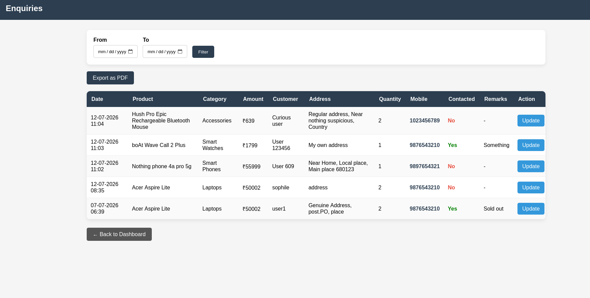
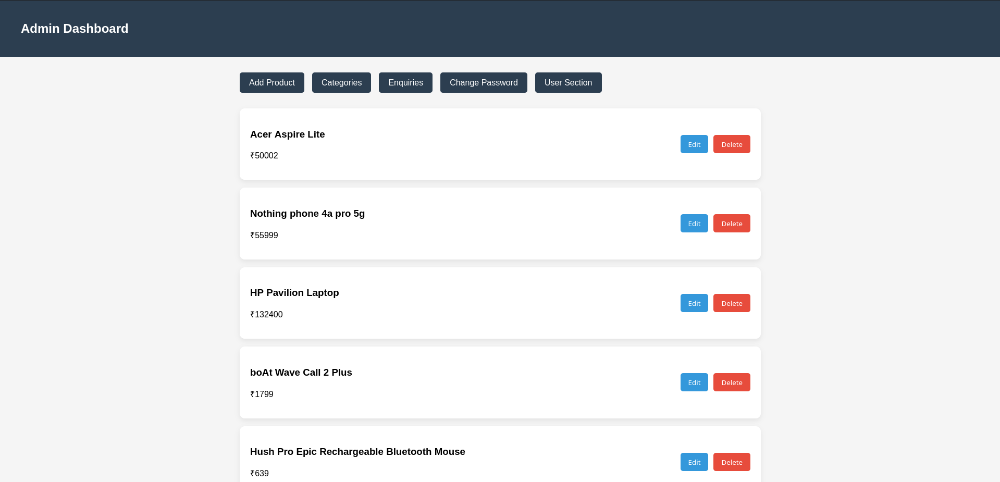
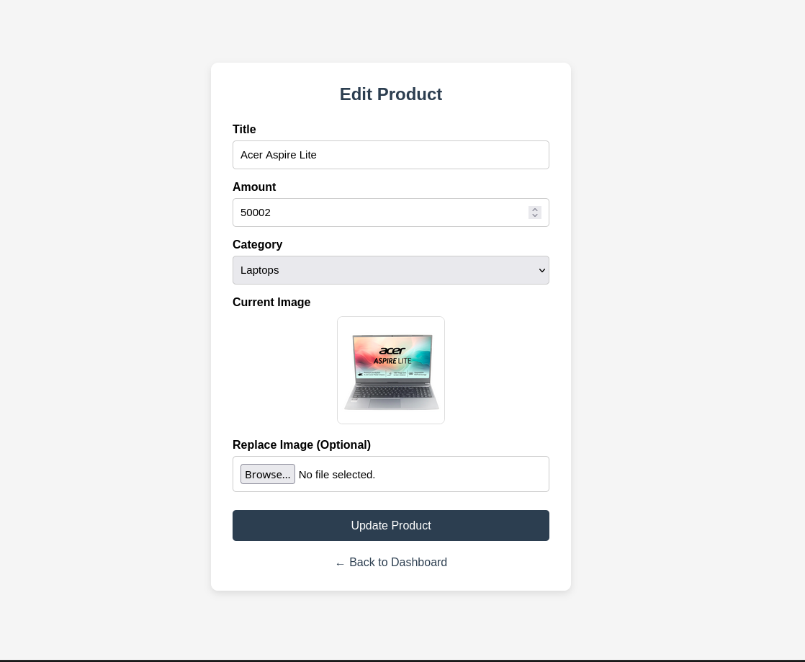
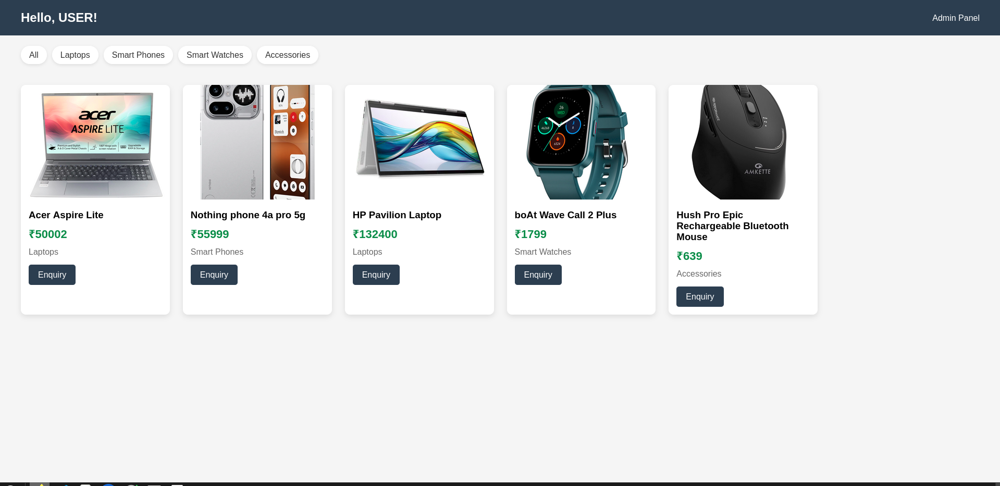
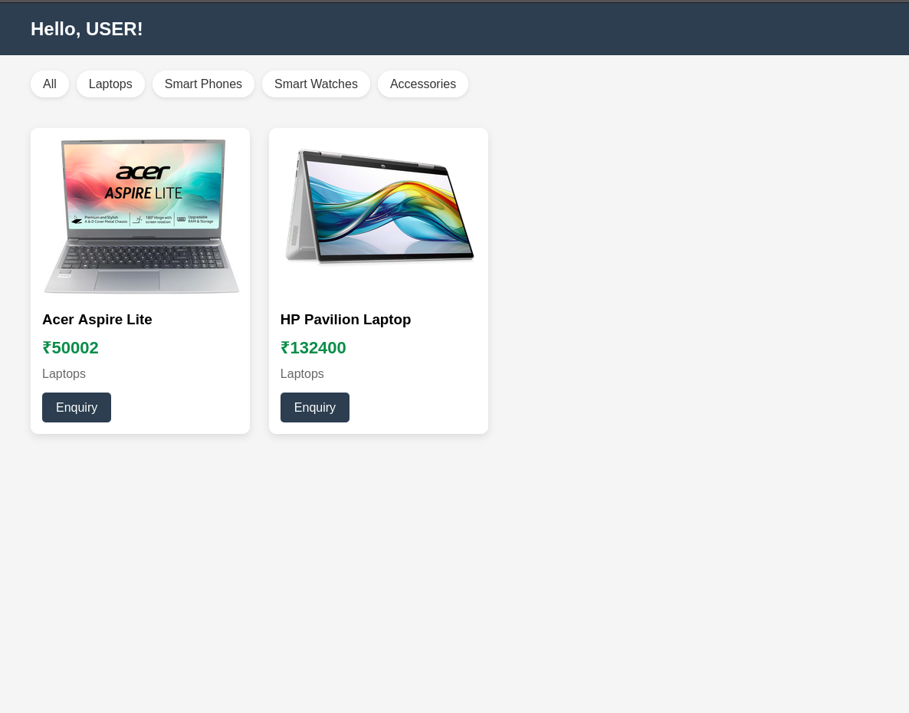

# Sales Management

This is a portfolio project for a sales management software.


## Screenshots

<p align="center">
  <a href="screenshots/enquiry.png">
    
  </a>
  <a href="screenshots/dash.png">
    
  </a>
  <a href="screenshots/edit_product.png">
    
  </a>
  <a href="screenshots/enquiry.png">
    
  </a>
  <a href="screenshots/enquiry.png">
    
  </a>
</p>

## Local Installation

1. Clone the project

1. Create a venv
```
Python3 -m venv myenv
source myenv/bin/activate
```
1. Install dependencies

> I have installed "Pillow" for image field and "xhtml2pdf" for pdf exports.
> Please install those or install requirements.txt for replication.

```
pip install -r requirements.txt
```
1. Run development server
```
python3 manage.py runserver
```


> [!NOTE]
> Use Username: staff1 and password: Pass@123 For demonstrative purposes


# Features

**Public/User Section**

1. Display products with:
     - Image
     - Price (Amount)

2. Filter products by category.
3. Each product should have an Enquiry button.
1. Enquiry form fields:
    - Name
    - Address
    - Quantity
    - Mobile Number

**Admin Section**

1. Secure admin login.

1. Manage product categories:
    - Add
    - Edit
    - Delete
1. Manage products:
    - Add
    - Edit
    - Delete
    - Assign category
1. Enquiry management:
    - Date
    - Product
    - Category
    - Amount
    - Customer name
    - Address
    - Quantity
    - Mobile number
1. Filter enquiries by From Date and To Date.
1. Export enquiry report as PDF.
1. Update enquiry:
    - Contacted (Yes/No)
    - Remarks
1. Individual enquiry reports (history per customer).
